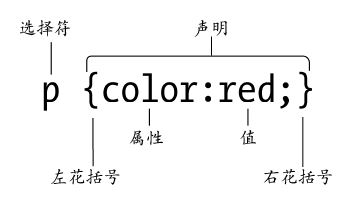

##  一、  为文档添加样式的三种方法
  1.  行内样式
  ```html
    <p style="font-size: 12px; font-weight: bold;"> 演示行内样式 </p>
  ```
  
  2.  嵌入样式
  ```html
    <head>
      <style type="text/css">
        h1 {font-size: 16px;}
        p {font-color: red;}
      </style>
    </head>
    <p>演示嵌入样式</p>
  ```
  
  3.  链接样式
  ```html
    <link href="style.css" rel="stylesheet" type="text/css" />
  ```

##  二、  CSS命名规则


CSS 命名规则有两部分：即选择符和声明。 声明又由两部分组成，即属性和值。
声明包含在一对{}中。

